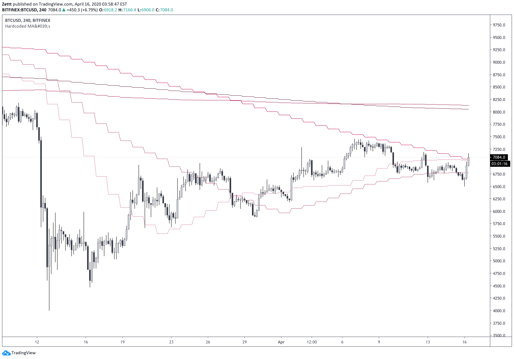
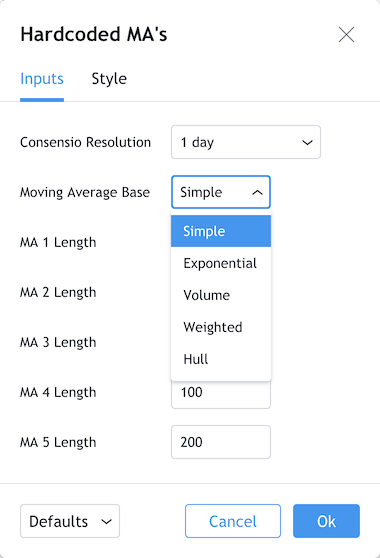

# Description

These are my Pine Script indicators free to use. If you find any of my code helpful for your projects, I'd appreciate a donation, and a reference to my work in your projects.

Bitcoin: `bc1q77mmp5uzehkuafkwjcrlah5260895jf0szplsz`

# Installation

* Open the Pine Editor on TradingView.
* Paste the script code in raw format into the editor.
* Click *Save* and/or *Add to Chart*.

The indicator is saved under *My Scripts* in the *Indicators & Strategies* menu.

## Hardcoded Moving Averages:

This is indicator adds 5 moving averages to your chart. These are hardcoded to a specific time interval. Using this indicator you can set your moving averages to be based on the daily. When you are charting the hourly, you can always keep an eye on the daily. This way you don't have to switch between time frames constantly.

There's also a menu, which allows you to switch between different variants of moving averages. Simple, exponential, volume, weighted, and Hull moving averages are availabe.

## RSI-VWMA

RSI on a volume-weighted moving average.

## Stochastic

Stochastic with thicker lines when %K, and %D are above the user defined up and down thresholds. Otherwise it's the same script from TradingView. Personally I don't like the purple background fill, so it's 100% transparent. Adjust if you don't like it.

