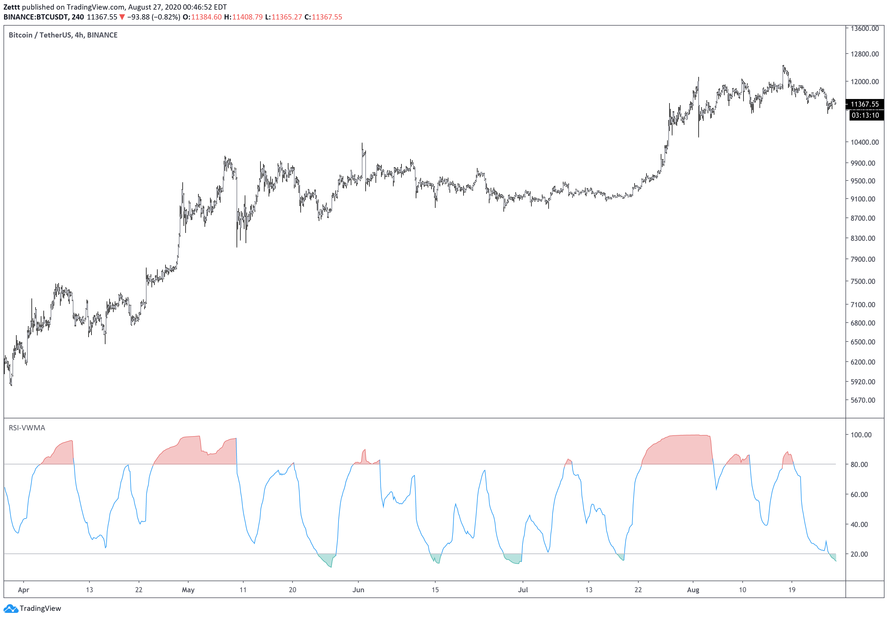
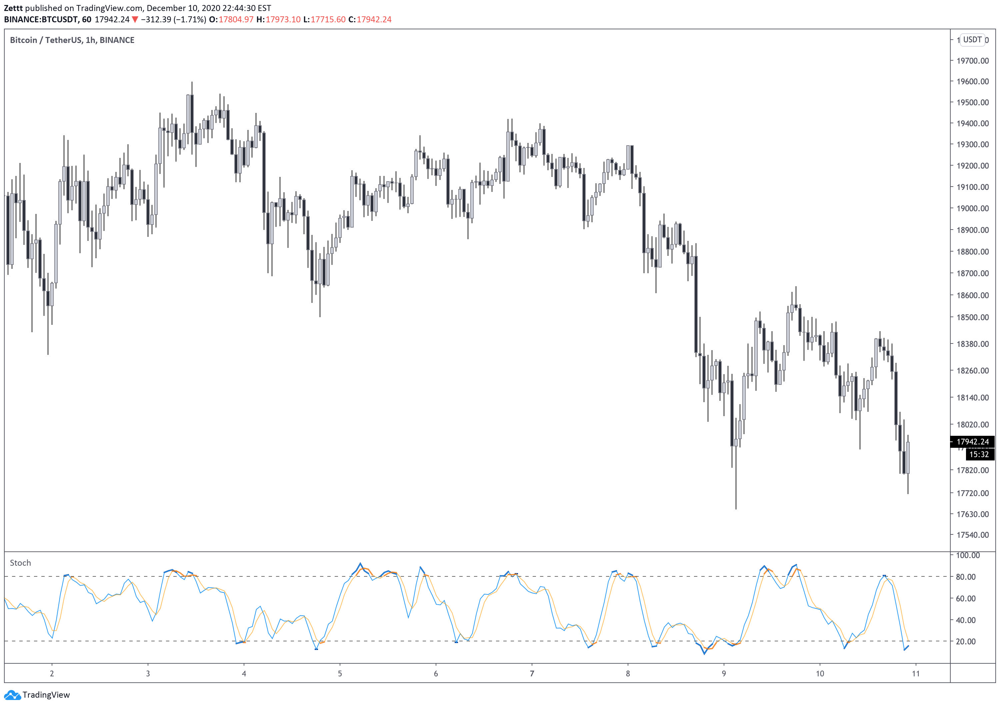

# PineScripts

Just some random PineScript ideas. Use as you wish.

## RSI-VWMA

RSI on a volume-weighted moving average.

## Stochastic

Stochastic with thicker lines when %K, and %D are above the user defined up and down thresholds. Otherwise it's the same script from TradingView. Personally I don't like the purple background fill, so it's 100% transparent. Adjust if you don't like it.

