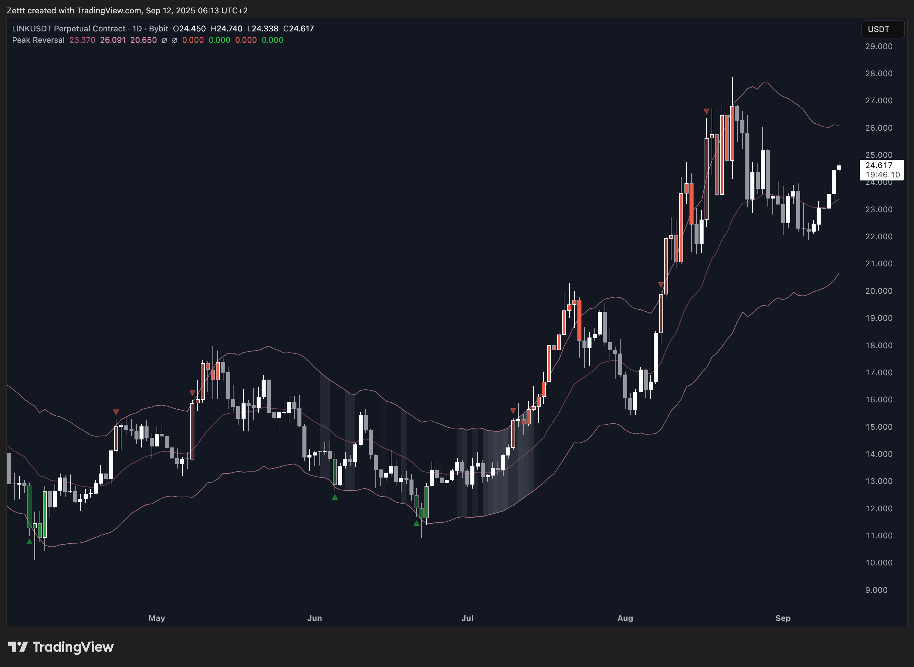

# Description

These are my Pine Script indicators free to use. If you find any of my code helpful for your projects, I'd appreciate a donation, and a reference to my work in your projects.

My personal Telegram channel: [t.me/zettt_trading](https://t.me/zettt_trading)

Bitcoin: `bc1q77mmp5uzehkuafkwjcrlah5260895jf0szplsz`

# Installation

* Open the Pine Editor on TradingView.
* Paste the script code in raw format into the editor.
* Click *Save* and/or *Add to Chart*.

The indicator is saved under *My Scripts* in the *Indicators & Strategies* menu.

## Peak Reversal v3

Peak Reversal v3 identifies reversals by combining Keltner Channels with a Squeeze Detector. Candles outside ATR bands mark momentum extremes and increase mean‑reversion odds; the longer price stays outside, the higher the risk of a turn. Squeezes signal possible moves, channels define entry/exit zones, momentum confirms. Bar confirmation reduces repainting.

## Hardcoded Moving Averages:

This is indicator adds 5 moving averages to your chart. These are hardcoded to a specific time interval. Using this indicator you can set your moving averages to be based on the daily. When you are charting the hourly, you can always keep an eye on the daily. This way you don't have to switch between time frames constantly.

There's also a menu, which allows you to switch between different variants of moving averages. Simple, exponential, volume, weighted, and Hull moving averages are availabe.

## RSI-VWMA

RSI on a volume-weighted moving average.

## Stochastic

Stochastic with thicker lines when %K, and %D are above the user defined up and down thresholds. Otherwise it's the same script from TradingView. Personally I don't like the purple background fill, so it's 100% transparent. Adjust if you don't like it.

## DMI

A slight variation on the standard TradingView DMI indicator. This one shows trend zones visually through color variation. Other than that doesn't have any other fancy features. I might add some like trend strength indication or something along those lines. Because this is seen as "not useful" by TradingView, it can't be published on TradingView. 

## VuManChu Cipher A

The original Market Cipher A is an indicator which copied several other indicators, and merged them into one indicator. VuManChu (and several others mentioned in the source code) did great work on uncovering this fraud, and providing an open source version of Market Cipher A. Personally I have some problems with the original Market Cipher A, as its signals are either a) confusing, b) too many, c) serve no value, or d) all together. As per my implementation this version adds few original new features, and generally just tries to clean up the code, as well as make the indicator a lot more usable. Please keep in mind that I may not update the code any further, but if it scratches my itch, I might. You can submit feature requests on this site or on my Telegram channel mentioned above.

New features mainly include:

* Gives short signals now too. Almost all signals that were only available on the long side, are now also available for shorts.
* Removes *a lot* of cruft. Many of the original signals only added lots of crosses, triangles, and whatnot to the chart, which were either contradicting or nonsensical. This is not a fault of VuManChu or anyone involved in open-sourcing Cipher A, but rather the misunderstanding of the original creator (Crypto Face) in technical analysis. So while this version adds signals for bears now too, most of these signals are hidden by default, because, as mentioned, they serve not much purpose. Feel free to turn them on from the settings. I did not yet come around to fully implement where these signals are displayed, and color them for down and uptrends appropriately. 
* Updated UI: I used my UI design skills to give the indicator an updated look. For example using linewidth 1 instead of 2 because moving averages are too thick on modern versions of TradingView. The colors are also a lot more subtle, and use the current TradingView color palette.
* Updated alerts: Cipher A implements alerts the short alert now too, and you can even set one alert that fires for long, as well as the short signal. I recommmend setting "Condition = Cipher A", "Long/Short Signal", "Options = Once per Bar Close". 

## Super SuperTrend

Inspired by a YouTube strategy, this indicator uses three SuperTrend indicators for long/short signals. The plots are off by default. 

